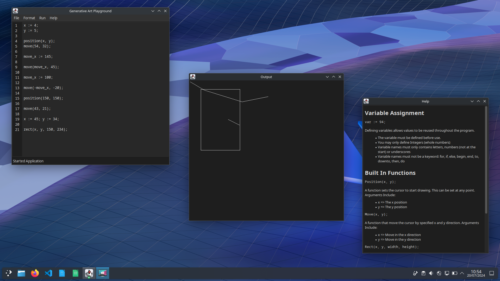

# Generative Art Playground

> A simple tool to experiment generating art via programming locally.

This program was part of my dissertation/capstone submission in July 2024. This contains
the beginnings of an interpreter however, it has not been fully compeleted. Work is still
in progress to improve the program.

## Compilation

This project was created using the Maven build tool. This can be compiled into a JAR file.

## Requirements

- Java Version 17 or newer.
- At least 1.6 GHz Processor.
- At least 2GB Memory.

## Limitations and Known Issues

- Variables can only be unsigned integers.
- Cannot call functions inside of functions.
- Conditional statements are not possible.
- Iterative statements are not possible.
- There are only three functions available: Position, Move, Rect.
- Error Messages are not informative enough.
- Error Painting Output Window when running input.