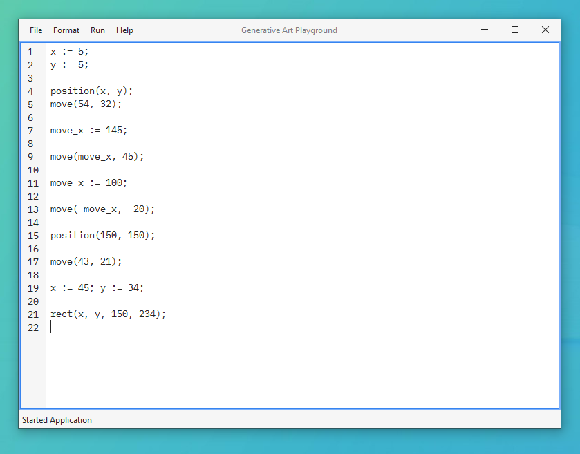
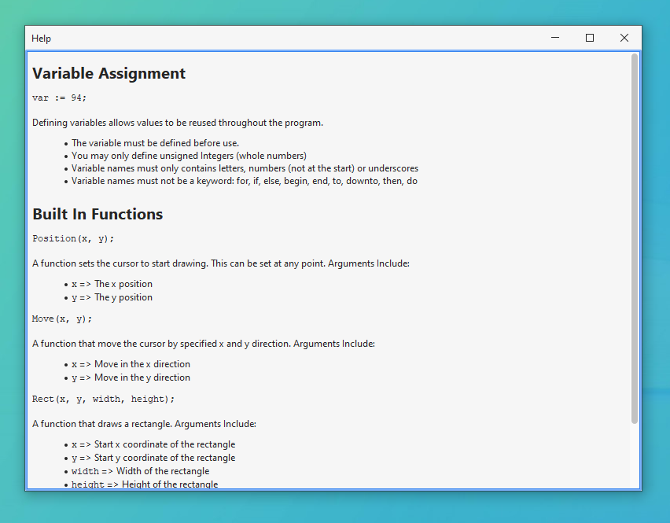

# Algorithmic Art Playground (AAP)

> [!NOTE]
> This project is still in development, despite finishing the dissertation.

## Overview

The "Algorithmic Art Playground" is an application designed for users to experiment with
generating art through the power of programming. As a part of my dissertation project, I
developed this tool as both an educational resource for those learning about algmorithmic
approaches to creativity and a personal cavas where you can experiment with code-based
visuals on your local desktop machine.

## Compilation and Execution

The Maven build tool was utilised for handling dependencies, development and deployment.
Most IDEs, such as IntelliJ IDEA, VSCode and NetBeans support Maven. This project requires
Java 17 or newer.

## Usage

### Editor Window

AAP provides a basic "Editor Window", where users can craftcode snippets directly to
produce art. The window features the use of the default monospace font based on the OS for
easier readibility, as well as a panel denoting line numbers. A status bar is also
featured, displaying information in a non-noisy manner.

* Additionally, the user may change the font to their preference by typing the name of the
font in the "Font Changer" window, found under the Format menu item.
* The program supports the ability to save files (as a .txt file) and open existing files.

### Output Window

The "Output Window" displays the result of art generation based on the user input. This
window is not limited to one instance nor modal. This can easily be resized.

### Help Window

The "Help Window" is a go-to resource for guidance. This contains a glossary of functions,
each accompanied by a description. This does not require the internet to access.

## Known Issues and Limitations

* The program supports only unsigned integers as variables, and does not support calling
functions inside of functions, conditional statements, iterative statements, or using more
advanced features such as mathematical expressions or control flow construction.
* The current only supports three basic functions: `Position`, `Move` and `Rect`. These
functions allow you to manipulate a virtual canvas (the "generative art"). However, there
are currently not advanced features in the program that would allow for more complex
generative art creation.
* Some known issues with the current version of AAP:

  * Error messages are not informative enough, making it difficult to debug any iddues
  that may arise during the execution of the program.
  * The program sometimes output an error painting the output when running the input.
  * Some options presented within the menu bar may not be functional.

## References

* Flatlaf (under Apache 2.0): <https://www.formdev.com/flatlaf/>
* JUnit (under EPL 2.0): <https://junit.org/junit5/>
* JetBrains Java Annotations (under Apache 2.0): <https://github.com/JetBrains/java-annotations>
